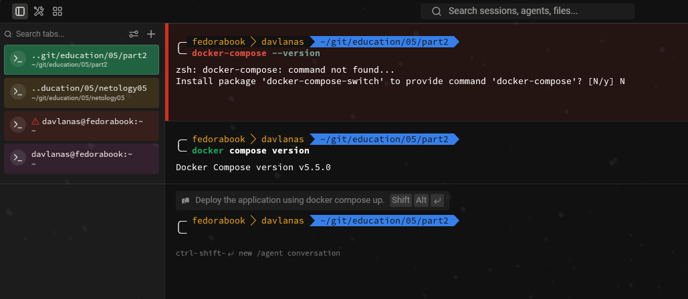
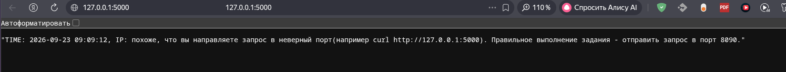
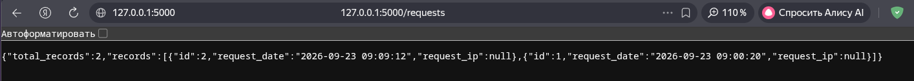
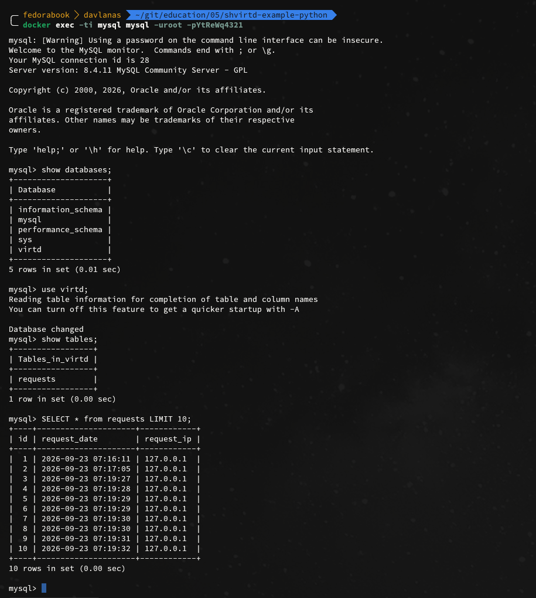
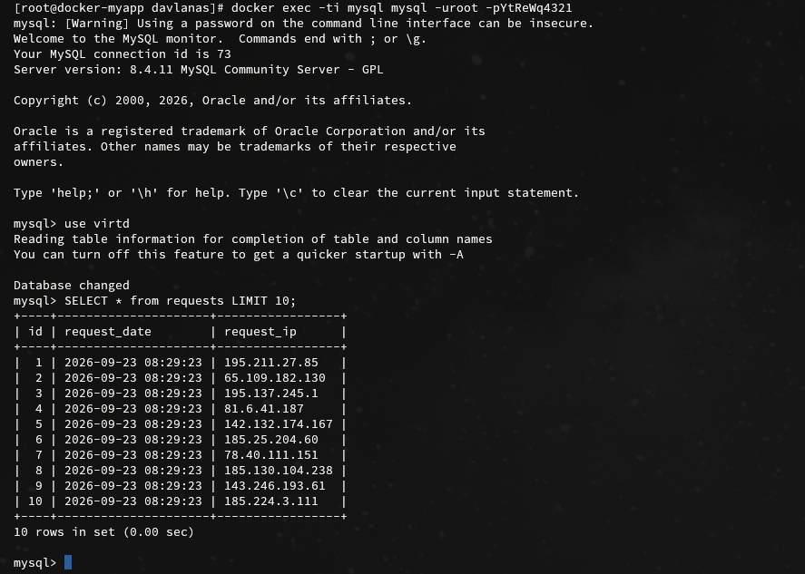
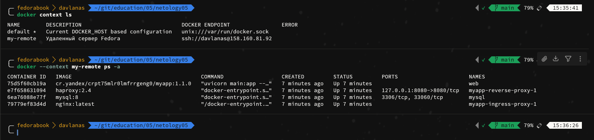
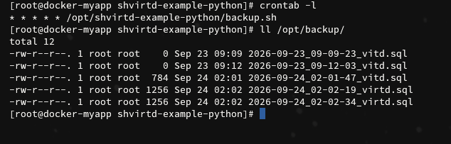
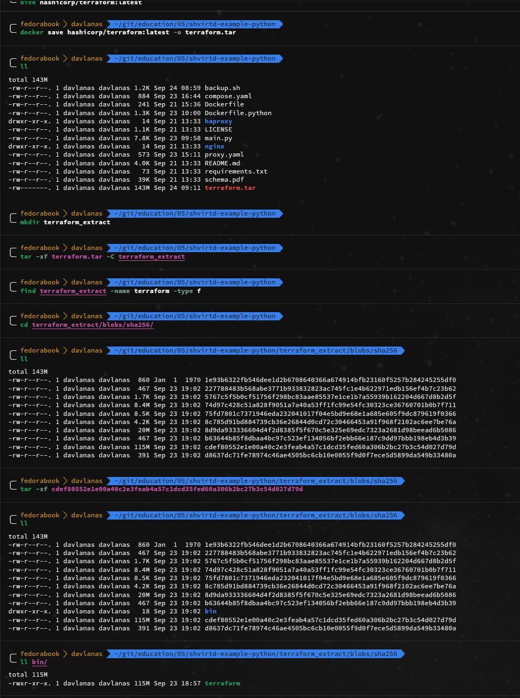

### Задача 0



### Задача 1

## Лоальный запуск приложения

# Зерультат выполнения в консоли

```
╰─ docker compose up -d
[+] up 2/2
 ✔ Network myapp_default Created                                                                                                                                                                                                                                                                                                                                                0.1s
 ✔ Container mysql       Started                                                                                                                                                                                                                                                                                                                                                0.4s
╭─ fedorabook  davlanas  ~/git/education/05/part2/docker-practice/local                                                                                                                                                                                                                                                                     ✔   main ● ?  79% 🔋  08:59:48 
╰─ export DB_HOST='127.0.0.1' \
export DB_USER='app' \
export DB_PASSWORD='123qweASD' \
export DB_NAME='myapp'
╭─ fedorabook  davlanas  ~/git/education/05/part2/docker-practice/local                                                                                                                                                                                                                                                                     ✔   main ● ?  79% 🔋  08:59:55 
uvicorn main:app --host 0.0.0.0 --port 5000 --reload
INFO:     Will watch for changes in these directories: ['/home/davlanas/git/education/05/part2/docker-practice/local']
INFO:     Uvicorn running on http://0.0.0.0:5000 (Press CTRL+C to quit)
INFO:     Started reloader process [2295520] using WatchFiles
INFO:     Started server process [2295526]
INFO:     Waiting for application startup.
Приложение запускается...
Соединение с БД установлено и таблица 'requests' готова к работе.
INFO:     Application startup complete.
INFO:     127.0.0.1:57218 - "GET / HTTP/1.1" 200 OK
INFO:     127.0.0.1:36880 - "GET / HTTP/1.1" 200 OK
INFO:     127.0.0.1:36880 - "GET /favicon.ico HTTP/1.1" 404 Not Found
INFO:     127.0.0.1:43442 - "GET /requests HTTP/1.1" 200 OK
INFO:     127.0.0.1:45226 - "GET /docs HTTP/1.1" 200 OK
INFO:     127.0.0.1:59514 - "GET /requests HTTP/1.1" 200 OK
```
# Docker compose для тестового запуска MySQL

```
name: myapp
services:
  db:
    image: mysql:9.7.2
    restart: unless-stopped
    container_name: mysql
    environment:
      - MYSQL_DATABASE=myapp
      - MYSQL_USER=app
      - MYSQL_PASSWORD=123qweASD
      - MYSQL_ROOT_PASSWORD=1qaz@WSX
    ports:
      - "3306:3306"
```
# Вывод на запрос curl

```
curl http://localhost:5000
"TIME: 2026-09-23 09:00:20, IP: похоже, что вы направляете запрос в неверный порт(например curl http://127.0.0.1:5000). Правильное выполнение задания - отправить запрос в порт 8090."% 
```





```
 curl http://localhost:5000/requests
{"total_records":2,"records":[{"id":2,"request_date":"2026-09-23 09:09:12","request_ip":null},{"id":1,"request_date":"2026-09-23 09:00:20","request_ip":null}]}
```
# Создание таблицы с помощью ENV

```
uvicorn main:app --host 0.0.0.0 --port 5000 --reload
INFO:     Will watch for changes in these directories: ['/home/davlanas/git/education/05/part2/docker-practice/local']
INFO:     Uvicorn running on http://0.0.0.0:5000 (Press CTRL+C to quit)
INFO:     Started reloader process [2450923] using WatchFiles
INFO:     Started server process [2450998]
INFO:     Waiting for application startup.
Приложение запускается...
Соединение с БД установлено и таблица 'test' готова к работе.
INFO:     Application startup complete.
^CINFO:     Shutting down
INFO:     Waiting for application shutdown.
Приложение останавливается.
INFO:     Application shutdown complete.
INFO:     Finished server process [2450998]
INFO:     Stopping reloader process [2450923]
```

```
docker exec -it mysql bash
bash-5.1# mysql -h 127.0.0.1 -P 3306 -u app -p123qweASD myapp -e "SHOW TABLES;"
mysql: [Warning] Using a password on the command line interface can be insecure.
+-----------------+
| Tables_in_myapp |
+-----------------+
| requests        |
| test            |
+-----------------+
```

# Ссылка на fork

[fork](https://github.com/darthdavvlanas/shvirtd-example-python)

### Задача 2

## Вывод отчета о сканировани

```
yc container image scan crpc7bhs4152vfp52q56
done (1m1s)
id: che2822bjvpv6o54nn13
image_id: crpc7bhs4152vfp52q56
scanned_at: "2026-09-23T03:11:44.908Z"
status: READY
vulnerabilities:
  high: "44"
  medium: "49"
  low: "57"
  undefined: "2"
```
### Задача 3

SQL запрос к БД на локальном ПК \


### Задача 4

SQL запрос к БД на ВМ в YC \


Выполнения docker ps -a через remote context \


### Задача 5

Скриншот crontab и бэкапов в /opt/backup \


### Задача 6

Извлеченный файл terraform \
